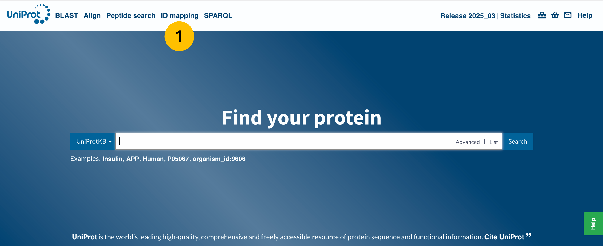
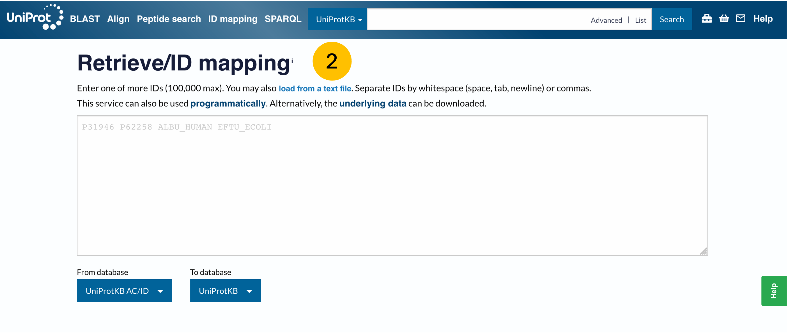
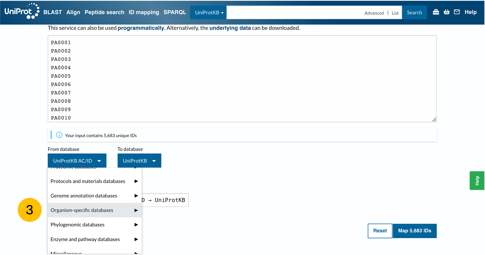
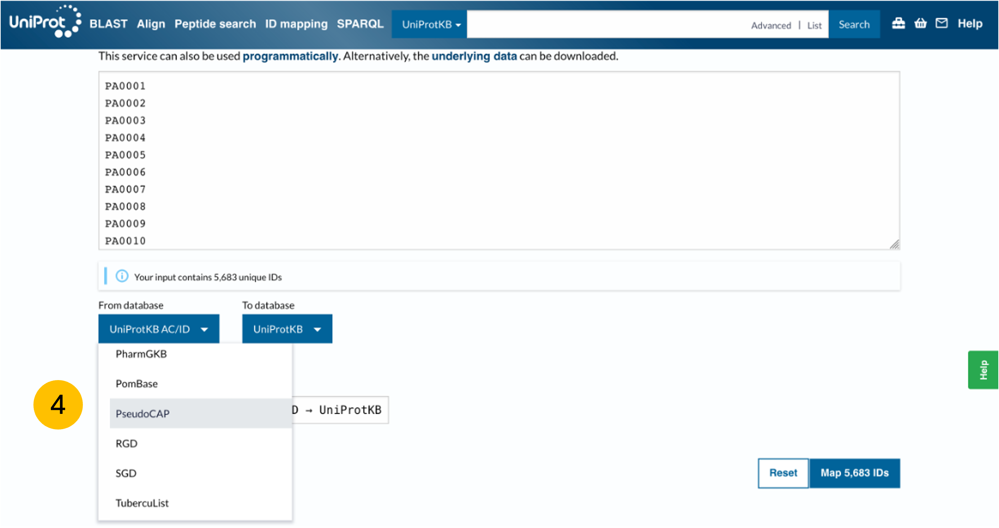
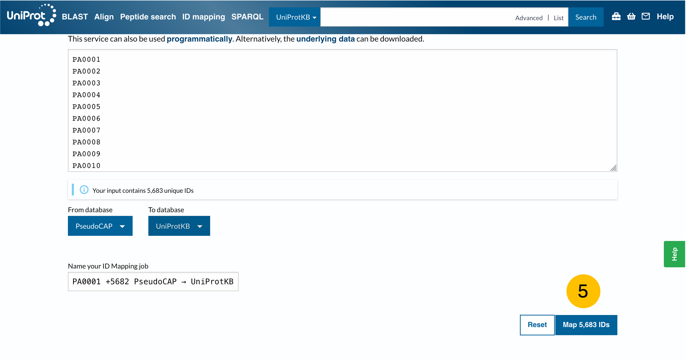

### Bacterial RNAseq analysis using `HISAT2` and `HTSeq`

#### Introduction

Many RNAseq analysis packages are designed for use with human or model organism data and so these packages often come with human databases pre-installed. However, if you need to perform analysis on data from your chosen bacterial species you may need to build your own database to align your reads to.

We're going to look at how to use NCBI `datasets` to download reference files, how to use `HISAT2` to build a reference index and align reads, `HTSeq` to count aligned reads, and finally how to use UniProt to assign UniProt and other database identifiers to your genes (if your species has a suitable database!).

#### In the terminal: log in and create `conda` environment

```{bash,eval=FALSE}
# log in to the cluster
ssh ws<YOUR ID>@fairbioinformatics.dartmouth.edu
```

```{bash,eval=FALSE}
# create your conda environment
# you can call it whatever you want! 
conda create -n bact_rna

# check that the environment has been created
conda info --envs

# activate the environment
conda activate bact_rna
```

#### In the terminal: install required packages in `conda` environment

```{bash,eval=FALSE}
conda install bioconda::pysam

conda install conda-forge::numpy

conda install conda-forge::ncbi-datasets-cli

conda install bioconda::hisat2
```

`HTSeq` is a python package so is installed via `pip` (**P**ip **I**nstalls **P**ackages)

```{bash,eval=FALSE}
pip install HTSeq
```

Check that the packages are installed correctly

```{bash,eval=FALSE}
# list installed packages in named environment
conda list -n bact_rna
```

#### In the terminal: create director and symlinks for trimmed reads

The trimmed reads that we will use are stored in the main workshop directory, you will use symlinks to access them

```{bash,eval=FALSE}
# make directory
mkdir trimmed_reads

# change to new directory
cd trimmed_reads

# create symlinks
ln -s /data/workshop-00/bact_raw/1-CL1_TAACTTGG-GTCGTGAA_L004_R1_001.fastq.gz S1_R1.fastq.gz

ln -s /data/workshop-00/bact_raw/1-CL1_TAACTTGG-GTCGTGAA_L004_R1_001.fastq.gz S1_R2.fastq.gz

# check that the symlinks have been created and that you have rwx permissions
ls -l
```

#### In the terminal: use NCBI `datasets` to download the required reference files

```{bash,eval=FALSE}
datasets download genome accession GCF_000006765.1 --include gff3,genome

# check zipped archive has been downloaded
ls

# unzip archive
unzip ncbi_dataset.zip

# look for reference files
ls /data/ws<YOUR ID>/ncbi_dataset/data/GCF_000006765.1
```

There should be two files in this directory:

-   GCF_000006765.1_ASM676v1_genomic.fna
-   genomic.gff

If you visit an NCBI genome page there is a tab labeled "datasets" that you can click to automatically generate the code needed to download the dataset from the command line. Generally, NCBI datasets contain several reference files but here we've only downloaded the GFF annotation and the genome (.fna) files because those are all we need for the analysis we're doing today.

#### In the terminal: building a reference index using `HISAT2`

Now we will build an index from our reference genome. It is important to make sure your genome file and annotation file are downloaded from the same source or the results will not play nicely together later on.

```{bash,eval=FALSE}
# make a build directory
mkdir build

# use hisat2-build function
hisat2-build -p 16 /data/ws08/ncbi_dataset/data/GCF_000006765.1/GCF_000006765.1_ASM676v1_genomic.fna /data/ws08/build/PAO1

# check that the index files have been created
ls build
```

#### In the terminal: align reads using `HISAT2`

Now we have an index we can align to, so we can use `HISAT2` to generate a .sam file which contains alignment information

```{bash,eval=FALSE}
# make a directory for aligned results
mkdir aligned_reads

# use hisat2 function to perform alignment
hisat2 -p 16 -q --phred33 --summary-file aligned_reads/S1_alignment_summary.txt -x build/PAO1 -1 trimmed_reads/S1_R1.fastq.gz -2 trimmed_reads/S1_R1.fastq.gz -S aligned_reads/S1_aligned.reads.sam

# navigate to aligned_reads directory
cd aligned_reads

# look at alignment summary file
cat S1_alignment_summary.txt
```

#### In the terminal: count reads using `HTSeq`

Now we have a .sam file containing our alignments that we can feed into `HTSeq` to count aligned reads per locus tag

```{bash,eval=FALSE}
# make output directory
mkdir htseq

# count reads
htseq-count -f sam -t gene -i locus_tag aligned_reads/S1_aligned.reads.sam ncbi_dataset/data/GCF_000006765.1/genomic.gff > htseq/S1_counts.tsv
```

#### In the terminal: transfer results file from cluster to local machine

On Mac (sorry, I don't know how to do this in a Windows terminal) hit Command+T to open a new terminal tab. This tab will open on your local machine and **will not** be signed into the cluster. You can now use this tab to use `scp` to download your counts file onto your machine for import into R.

```{bash,eval=FALSE}
scp ws<YOUR ID>@fairbioinformatics.dartmouth.edu:/data/ws08/htseq/S1_counts.txt /path/to/downloads
```

#### In RStudio: load packages and read in data

```{r}
library(tidyverse)
```

Read in count table

```{r}
read.table("S1_counts.tsv",
           col.names = c("locus_tag","count")) -> counts
```

#### In RStudio: extract locus tags for use with UniProt database

```{r}
counts$locus_tag -> locus_tag

write(locus_tag,
      "locus_tag.txt")
```

#### In a browser: load text file containing locus tags into UniProt browser

Load text file into UniProt, download desired column information.

    

Import UniProt data into R

```{r}
read.table("idmapping_2025_07_05.tsv",
           sep = "\t",
           header = TRUE,
           fill = TRUE) %>%
  left_join(counts,., # join together counts table and imported uniprot data
            join_by(locus_tag == From)
  ) -> counts_uniprot

#examine data
head(counts_uniprot)
```

This is only the beginning of the pipeline for bacterial RNAseq analysis but it can be quite different depending on the organism you're using. Feel free to reach out with any questions and I'll do my best to help!
